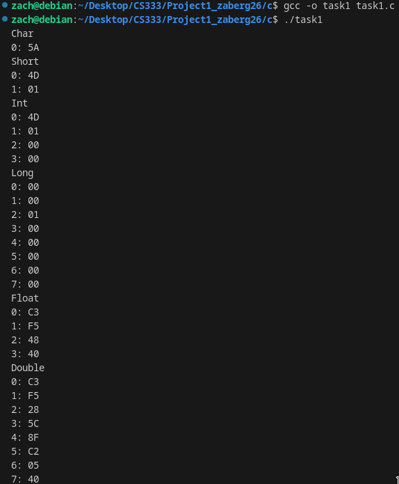
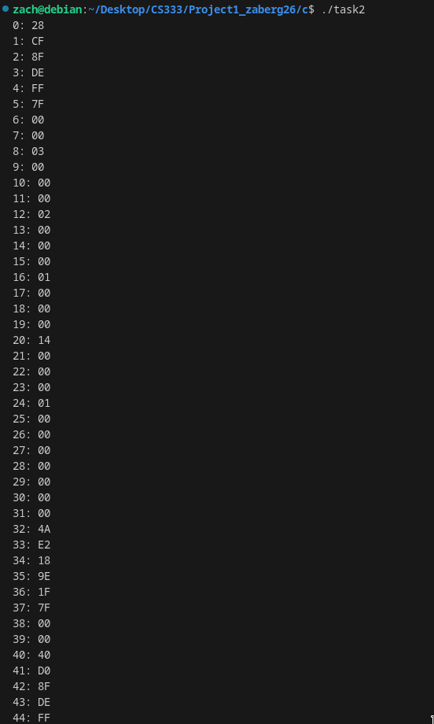
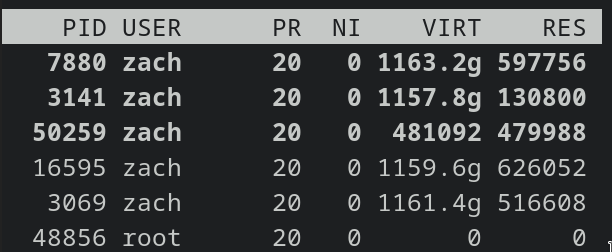
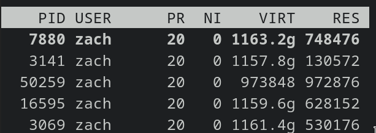
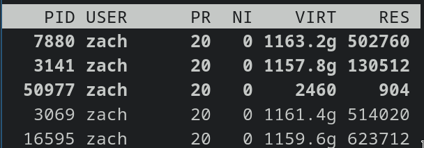
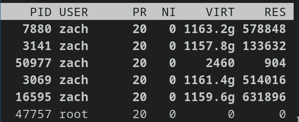
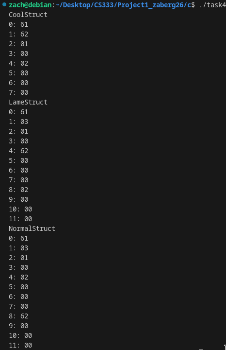
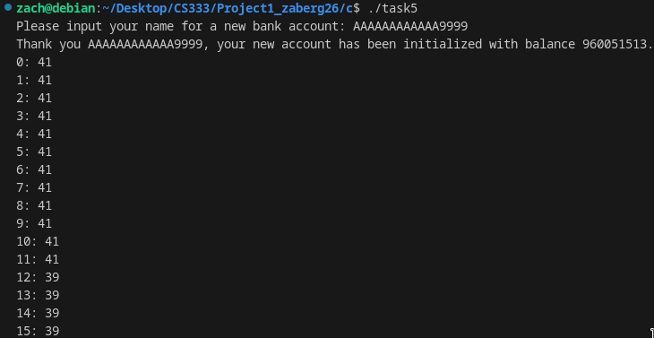

# CS333 - Project # - README
### Zachary Berg
### 02/19/2024

***Google Sites Report: https://sites.google.com/colby.edu/zaberg26cs333/project-1 ***

## Directory Layout:
```
proj01/
|
|__/C/
|  |
|  |__/task1.c
|  |__/task2.c
|  |__/task3.c
|  |__/task4.c
|  |__/task5.c
|__/images/
|  |
|__|__|ctask1.png
|__|__|ctask2.png
|__|__|ctask3.png
|__|__|ctask4.png
|__|__|ctask5.png
```
## OS and C compiler
OS: Debian 12 Bookworm
C compiler: (Debian 12.2.0-14) 12.2.0

## Part I 
### Task 1
**Compile:** $ gcc -o task1 task1.c

**Run:** $ ./task1

**Output:**


**Q.b.** 

Little-endian

**Q.c.** 

My machine is little-endian because the least significant bytes come first. This is easily seen in my int, which only has a value of 333 while it has space for a much larger value so only the 2 least signficant bits are used, because these two bits appeast first, it is clear that my machine is little endian.
 
### Task 2
**Compile:** $ gcc -o task2 task2.c

**Run:** $ ./task2

**Output:**


**Q.b.** 

The most recently assigned varaible is at the top and variables assigned earlier are below it. When it gets past the first assigned varaible, it has stuff that isn't relate to your program and it isn't the same every time you run it. 

**Q. c.**

Yes, the non zero values below my earliest assigned variable appear to be nonsense to me, I'm not certain if it is leftover from prior running of this program or if it is just memory my computer is using for something else, or even not using at all.

**Q. d.**

Yes, I made it very easy to find my variables by making them small value ints. 1 is at index 16, 2 is at index 12, and 3 is at index 8. This makes it very obvious that things are pushed to the top of the stack (shocking... as that is in fact how stacks work) and that the char pointer pointing to itself is much less easily human readable than the small value ints are. Also ints use 4 bytes, while the char uses 6? This is confusing to me. How is there a nonzero value at index 5, should that not be part of the nope variable?

### Task 3
**Compile:** $ gcc -o task3 task3.c

**Run:** $ ./task3

**Q.a:**

LeakM Screenshots


For LeakM process 50259 is our program.

FreeM Screenshots


For FreeM process 50977 is our program.

**Q.b.** 
When using the LeakM function that the memory usage increases the longer the program runs. I manually quit the program after it had gotten large enough and I was close to running out. When using the FreeM function the memory usage was static regardless of how long the program ran for. I also manually quit this program after I was satisfied that the memory value would not change. I also noticed that my CPU was getting quite stressed from both functions, I believe this would be due to the frequency and number of operations occuring.

### Task 4
**Compile:** $ gcc -o task4 task4.c

**Run:** $ ./task4


Important Note: LameStruct and NormalStruct index 1 is leftover mem (not consistant between different runs of program)

**Q.a:**
No, I would expect all structs to have the same size, but this is not the case. CoolStruct is 8 bytes while both LameStruct and NormalStruct are 12 bytes. This is because CoolStruct is able to fit the 4 variables and 3 datatypes in the most efficient manner while LameStruct and NormalStruct waste space due to the way c handles structs. The variables are assigned in memory based on the order they are declared in the struct declaration, and certain datatypes require gaps between them. For instance, two chars can be stored directly next to eachother, while a short following a single char must skipe a byte and an int following a single char must skip 3 bytes. This is because a short must begin on an even (multiple of 2) and an int jmyst begin on a multiple of 4.

**Q.b.** 
Yes there are gaps prior to shorts so that the short may start on a multiple of 2 and ints so that an int may start on a multiple of 4 (both requiring a multiple of their size).

### Task 5
**Compile:** $ gcc -o task5 task5.c

**Run:** $ ./task5

**Q.a:**
AAAAAAAAAAAA9999

**Q.b.** 


**Q.c.**
Our input is 16 bytes long, the total length of the account struct. The name variable should only be 10 bytes long, then 2 wasted bytes, then 4 bytes for the int. Because our input exceeds this, but not the total length of the struct (which would cause a segmentation fault) the extra bits go into the balance bytes of the account struct. 